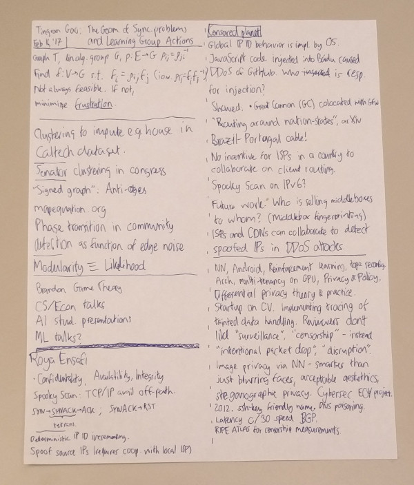
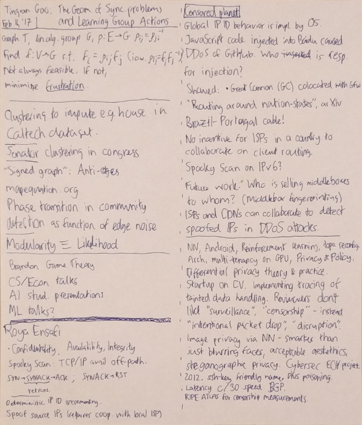
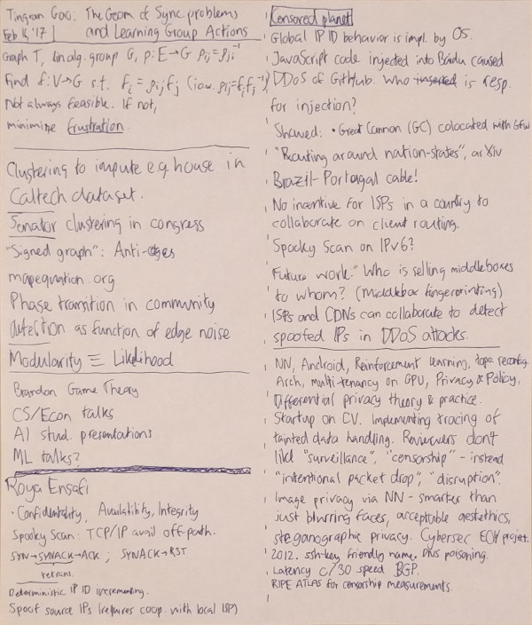
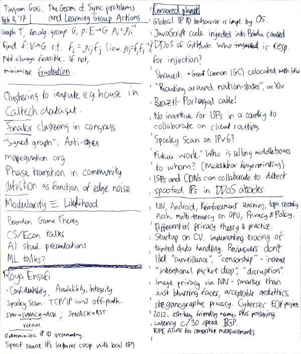

Correct a linear gradient in a photograph
=========================================

When photographing documents, whiteboards, or similar surfaces with drawings or text,
in uneven lighting from a side, the resulting photograph is typically more bright
in one side than in another. This causes issues when trying to convert the photograph
to a line drawing as brightness/contrast tools in image editing software typically
applies to the entire image uniformly.

This script removes any linear bias in the brightness of an image to produce
an image that appears more "flat".

Example input file:

After perspective transform:

After gradient fit:

After levels adjustment:

Installation
------------

Copy or symlink the file `gradient_fit.py` into ~/.gimp-2.8/plug-ins and make sure
to mark it executable.
